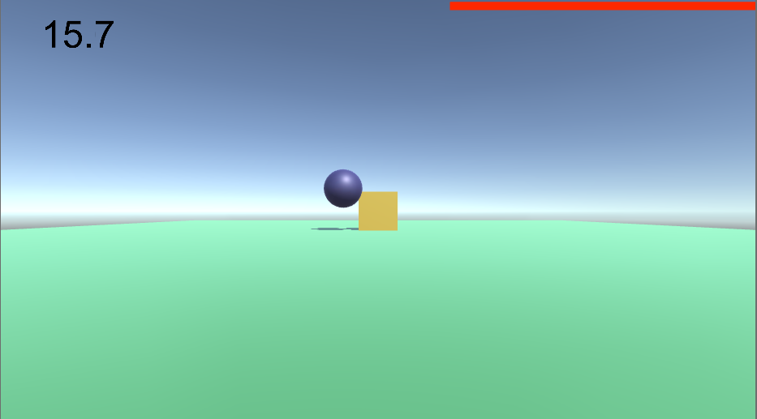

# BlockShoot

A simple Unity game demo.

You click on the screen to shoot. Try to knock the block off the table as soon as you can.

Mostly for my students to use in CMSC425, Game Programming, at the University of Maryland, College Park. If you're not one of my students, feel free to use this code anyway. If you're interested in becoming a student, let me know.

